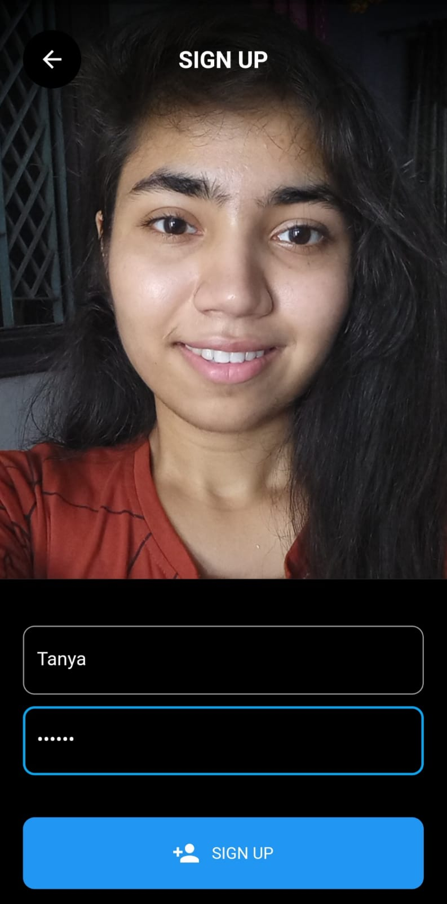
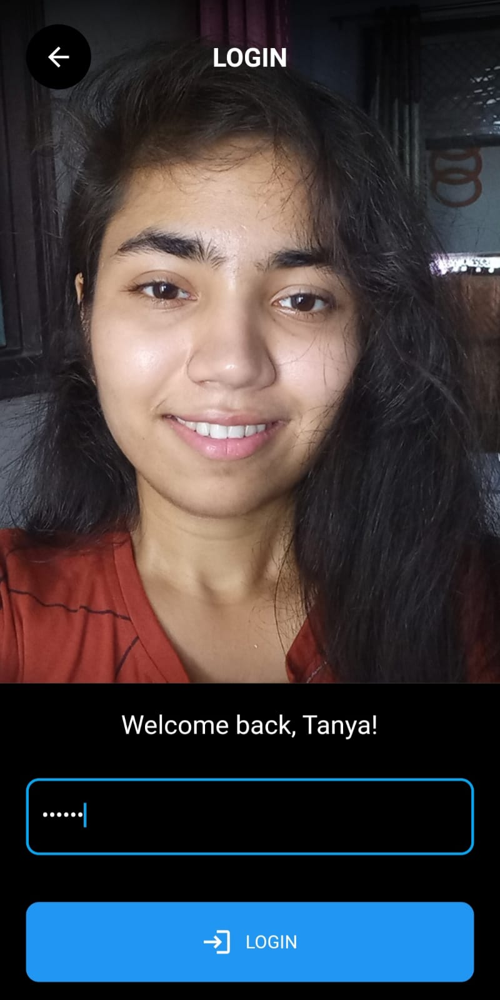
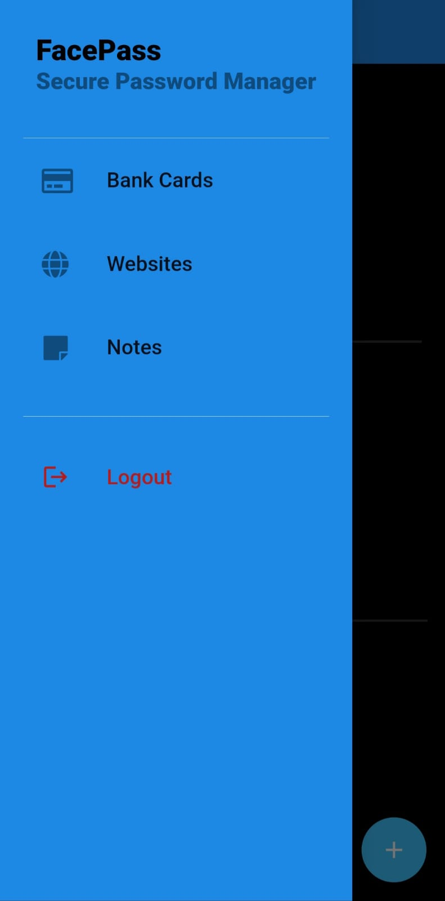
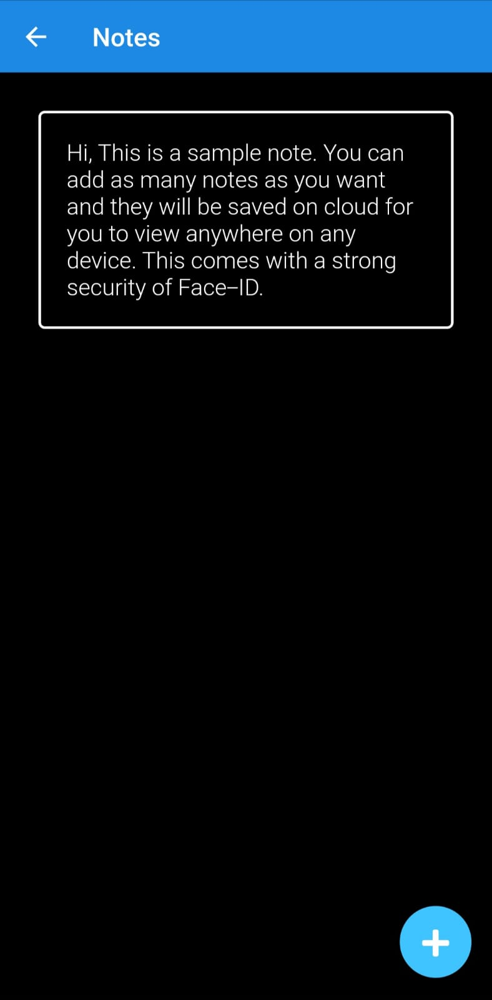

# FacePass - Your face-protected password vault
### <a href = "https://drive.google.com/file/d/1oJB8Y4eBdmj785g1nVlktg9exFQuDUFX/view?usp=sharing" >Video Demo</a>
## About The Project:
* Face Pass mobile application was built during Microsoft Engage 2022.
* It is a Password Manager app where users can store their credentials and important documents.
### Salient Features:
* User recognition and authentication via Tensorflow Lite.
* Adding and deleting bank cards and websites login credentials.
* Uploading and deleting important documents and notes.
### Compatible With:
Android and iOS devices
 
### Stack:
* Flutter:
  
  Flutter is an open source framework to create high quality, high performance mobile applications across mobile operating systems - Android and iOS.
* Tensorflow lite:
  
  TensorFlow Lite is an open source deep learning framework for on-device inference.

* Flutter + Tensrorflow lite = tflite_flutter package:
  
  TensorFlow Lite plugin provides a dart API for accessing TensorFlow Lite interpreter and performing inference. It binds to TensorFlow Lite C API using dart:ffi.

## Agile Methodology:
### What is Agile Methodology:
Agile is a development methodology adopted by the software industry. It is an iterative approach to software development. It promotes teamwork. It’s centered around adaptive planning, self-organization, and short delivery times. It’s flexible, fast, and aims for continuous improvements in quality, using tools like Scrum and eXtreme Programming.
### How I Incorporated Agile Methodology During The Development Cycle:
SCRUM is a subset of Agile, a framework for developing software. SCRUM takes advantage of different techniques to achieve goals in Agile. It promotes an iterative model where the planning is performed in a concise term. The basic time working unit is the sprint. SCRUM teams always reason in sprints, and their planning is limited to sprints.
* Sprint 1 (May 4): Sprint Planning, Research, and Design - Researched all three challenges and finalized the first challenge as I found it fascinating. After researching many face APIs used for face recognition, I finalized Tensorflow Lite. I searched for tutorials and designed the flowchart of the app.
* Sprint 2 (May 11): Software development and debugging - Started the development process by taking help from YouTube tutorials and online articles. 
* Sprint 3 (May 18): Built a cross-platform mobile application using Flutter and Firebase for the first time. I encountered occasional bugs, which I debugged timely and made the required changes in the UI and color scheme to make it more attractive.
## Getting Started:
To install and run the project on your local system, following are the requirements:
* Ensure that the device uses Android or iOS.
* Ensure that the device has a front camera to detect the face.
### Setup
1- Clone the repository:

``` git clone https://github.com/Tanyaverma3114/face_pass.git ```
 
2- Open the folder:
```cd face_pass```
 
3- Install dependencies:
```flutter pub get```
 
4- Run on device (Check device connected or any virtual device running):
```flutter run```

 
 
## Navigating Through The App:
### Login/ Signup
* First signup through face detection and enter name and password.
* Login to the app through face recognition and authentication and enter the password.





### Home Page
* The Home page has a drawer and an add button. An user can add their important notes, website and bank card details directly by clicking on the floating add button.
* The drawer has the options of Bank Cards, Websites, Notes and Logout.




### Bank Cards
* The 'Bank Cards' option in the drawer is the place where an user can check all the saved cards.
* It also has a floating add button through which an user can add details of other cards.
  


### Websites
* The 'Websites' option in the drawer is the place where an user can check all the credentials of different websites saved by them.
* It also has a floating add button through which an user can add credentials of other websites.


### Notes
* The 'Notes' option in the drawer is the place where an user can check all the saved notes.
* It also has a floating add button through which an user can add new notes.




### Logout
* The 'Logout' option in the drawer logs out the user.


## Resources Used:
* https://youtu.be/Ib2FlirtcmE		
* https://medium.com/analytics-vidhya/face-recognition-authentication-using-flutter-and-tensorflow-lite-2659d941d56e
* https://github.com/MCarlomagno/FaceRecognitionAuth
* https://youtu.be/2aSbeSun7K4
 
 

